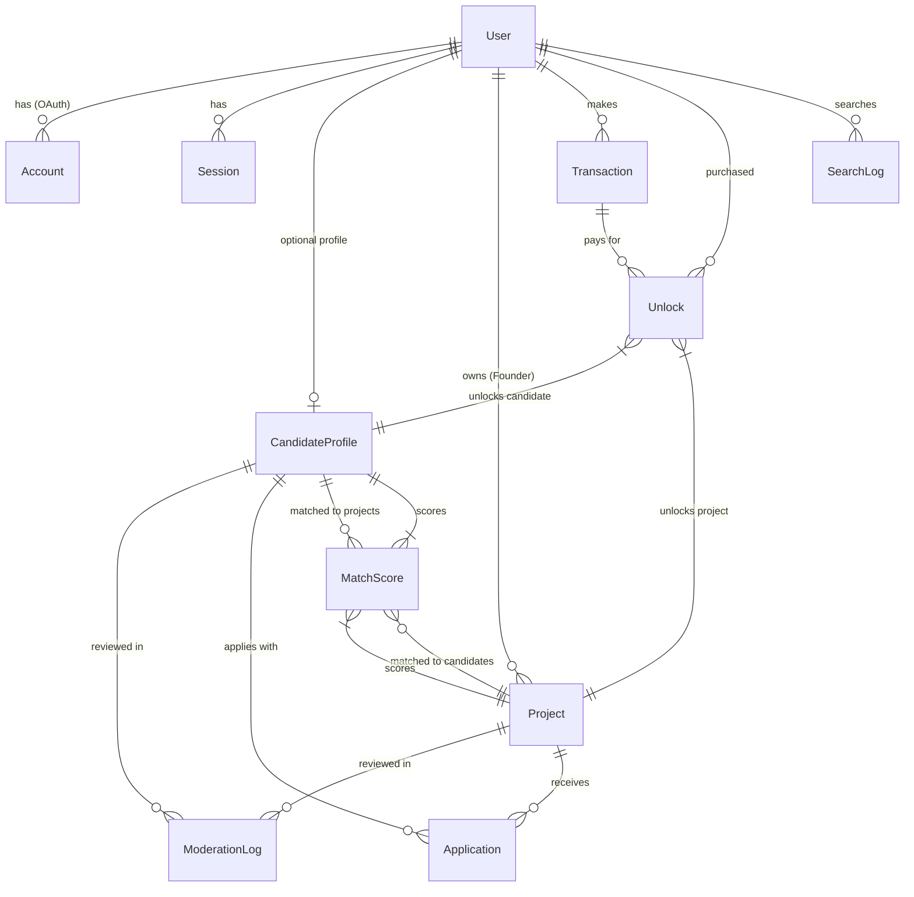

# Database Schema Architecture - Enhanced with AI Search

**Version:** 2.0  
**Date:** 2026-02-02  
**Status:** APPROVED  
**Author:** Architect & Analyst Agent  
**Tags:** [architecture, database, prisma, postgres, ai-search, vector-embeddings]

---

## Executive Summary

This document defines the **complete relational database structure** for the Co-Founder platform, enhanced with **AI-powered search capabilities**. The schema supports semantic search, intelligent matching, and analytics through vector embeddings and advanced scoring algorithms.

**Key Features:**
- 13 tables covering authentication, profiles, AI matching, payments, and system utilities
- Vector embeddings (pgvector) for semantic search
- Match scoring cache for performance
- Search analytics for continuous improvement
- 35+ new fields for intelligent candidate-project matching

---

## 1. High-Level Architecture

### Database Stack
- **Database:** PostgreSQL 15+
- **ORM:** Prisma 6.2+
- **Extensions:** pgvector (for embeddings)
- **Features:** JSONB, Arrays, Full-Text Search, Vector Similarity

### Entity Relationship Overview



---

## 2. Core Tables

### 2.1 Users & Authentication

#### `users`
**Purpose:** Central user table with complete contact information

**Key Fields:**
```prisma
model User {
  id            String    @id @default(cuid())
  
  // Contact Information
  firstName     String?
  lastName      String?
  email         String    @unique
  phone         String?   // +237XXXXXXXXX
  address       String?
  
  // Profile
  image         String?   // Avatar URL (Cloudflare R2)
  role          UserRole  @default(USER)
  
  // Timestamps
  createdAt     DateTime  @default(now())
  updatedAt     DateTime  @updatedAt
}
```

**Roles:**
- `ADMIN` - Platform administrator
- `FOUNDER` - Creates projects, searches candidates
- `CANDIDATE` - Creates profile, applies to projects
- `USER` - Default before role selection

**Relations:**
- 1→N: accounts, sessions, projects, transactions, unlocks, notifications, searchLogs
- 1→1: candidateProfile (optional)

---

#### `accounts`, `sessions`, `verification_tokens`
**Purpose:** NextAuth.js authentication tables

**Providers Supported:**
- Google OAuth
- LinkedIn OAuth
- Email/Password (future)

---

### 2.2 Profiles

#### `candidate_profiles`
**Purpose:** Candidate profiles with AI-enhanced search

**Core Fields:**
```prisma
model CandidateProfile {
  // Basic Info
  title         String    // "Senior React Developer"
  bio           String    @db.Text
  location      String?
  skills        String[]
  
  // Experience
  yearsOfExperience Int?
  experience    Json?     @db.JsonB  // LinkedIn import
  education     Json?     @db.JsonB
  languages     String[]  // ["French", "English"]
  certifications String[]
  
  // Links
  linkedinUrl   String?
  resumeUrl     String?   // Cloudflare R2
  portfolioUrl  String?
  githubUrl     String?
  
  // Matching Preferences
  desiredSectors    String[]  // ["Fintech", "Health"]
  desiredStage      String[]  // ["MVP", "Growth"]
  desiredLocation   String[]  // ["Douala", "Remote"]
  minSalary         Int?
  maxSalary         Int?
  availability      String?   // "IMMEDIATE", "1_MONTH"
  willingToRelocate Boolean
  remoteOnly        Boolean
  
  // AI Search (NEW)
  bioEmbedding      vector(1536)?  // Semantic search
  skillsEmbedding   vector(1536)?
  embeddingModel    String?        // "text-embedding-3-small"
  lastEmbeddedAt    DateTime?
  
  // Scoring (NEW)
  profileCompleteness Float  // 0-100
  qualityScore        Float  // AI-calculated
  
  // Privacy
  isContactVisible Boolean  @default(false)
  
  // Moderation
  status        ModerationStatus @default(DRAFT)
}
```

**Indexes:**
- `status` - Filtering published profiles
- `skills` - Array search (GIN)
- `desiredSectors` - Matching
- `location` - Geographic search

---

#### `projects`
**Purpose:** Founder projects with detailed requirements

**Core Fields:**
```prisma
model Project {
  // Basic Info
  name          String
  pitch         String    @db.Text
  description   String    @db.Text
  sector        String?   // "Fintech", "Health"
  stage         String?   // "Idea", "MVP", "Growth"
  logoUrl       String?
  
  // Details (NEW)
  teamSize      Int?
  fundingStatus String?   // "BOOTSTRAPPED", "SEED"
  techStack     String[]  // ["React", "Node.js"]
  websiteUrl    String?
  demoUrl       String?
  deadline      DateTime?
  
  // Requirements (NEW)
  requiredSkills    String[]
  niceToHaveSkills  String[]
  location          String?
  commitment        String?  // "FULL_TIME", "PART_TIME"
  budget            Json?    @db.JsonB
  isRemote          Boolean
  isUrgent          Boolean
  
  // AI Search (NEW)
  descriptionEmbedding vector(1536)?
  embeddingModel       String?
  lastEmbeddedAt       DateTime?
  
  // Scoring (NEW)
  urgency       Int    @default(5)  // 1-10
  qualityScore  Float  @default(0.0)
  
  // Moderation
  status        ModerationStatus @default(DRAFT)
}
```

**Indexes:**
- `status`, `sector`, `requiredSkills`, `isUrgent`

---

### 2.3 AI Matching & Search (NEW)

#### `match_scores`
**Purpose:** Cache AI matching scores for performance

**Schema:**
```prisma
model MatchScore {
  id              String   @id @default(cuid())
  candidateId     String
  projectId       String
  
  // Detailed Scores (0-100)
  overallScore    Float
  skillsMatch     Float
  experienceMatch Float
  locationMatch   Float
  culturalFit     Float
  
  // AI Reasoning
  aiReason        String?  @db.Text
  aiConfidence    Float    // 0-1
  
  // Metadata
  calculatedAt    DateTime @default(now())
  modelVersion    String   // "gpt-4-turbo-2024-01"
  
  @@unique([candidateId, projectId])
  @@index([projectId, overallScore(sort: Desc)])
  @@index([candidateId, overallScore(sort: Desc)])
}
```

**Usage:**
- Cache matching results for 24 hours
- Avoid expensive AI recalculations
- Enable instant "Top Matches" queries

---

#### `search_logs`
**Purpose:** Analytics for search improvement

**Schema:**
```prisma
model SearchLog {
  id              String   @id @default(cuid())
  userId          String?  // Null if anonymous
  
  // Query
  query           String
  filters         Json?    @db.JsonB
  searchType      String   // "CANDIDATE", "PROJECT"
  
  // Results
  resultsCount    Int
  topResultIds    String[]
  
  // Interaction
  clickedResultId String?
  clickPosition   Int?     // 1-based
  timeToClick     Int?     // Milliseconds
  
  createdAt       DateTime @default(now())
  
  @@index([query])  // Trending searches
}
```

**Analytics:**
- Trending searches
- Click-through rate (CTR)
- Search quality metrics
- ML training data

---

### 2.4 Moderation

#### `moderation_logs`
**Purpose:** AI moderation audit trail

**Fields:**
- `aiScore` (0-1) - Confidence
- `aiReason` - Explanation
- `aiPayload` (JSONB) - Full LLM response
- `status` - DRAFT | PENDING_AI | PUBLISHED | REJECTED

**Targets:** CandidateProfile OR Project (polymorphic)

---

### 2.5 Monetization

#### `transactions`
**Purpose:** Lygos Pay payments

**Fields:**
- `amount` (Decimal) - XAF amount
- `status` - PENDING | PAID | FAILED | REFUNDED
- `externalId` - Lygos transaction ID (unique)

#### `unlocks`
**Purpose:** Contact unlocking (privacy wall)

**Constraints:**
- Unique `[userId, targetCandidateId]` - Prevent double payment
- Unique `[userId, targetProjectId]`

---

### 2.6 Applications & Notifications

#### `applications`
**Purpose:** Candidate applications to projects

**Statuses:** PENDING | ACCEPTED | REJECTED | IGNORED

**Indexes:**
- `[projectId, status]` - Founder dashboard
- `candidateId` - "My Applications"

#### `notifications`
**Purpose:** In-app notifications

**Types:** SYSTEM | APPLICATION_RECEIVED | APPLICATION_ACCEPTED | APPLICATION_REJECTED | MODERATION_ALERT

---

## 3. AI Search Architecture

### 3.1 Vector Embeddings Strategy
**Purpose:** Store vector representations of text for semantic search

**Model:** DeepSeek Embeddings (1536 dimensions)

**Implementation:**
```typescript
// Generate embedding
import axios from 'axios';

const generateEmbedding = async (text: string) => {
  const response = await axios.post(
    'https://api.deepseek.com/v1/embeddings',
    {
      model: 'deepseek-embedding',
      input: text
    },
    {
      headers: {
        'Authorization': `Bearer ${process.env.DEEPSEEK_API_KEY}`,
        'Content-Type': 'application/json'
      }
    }
  );
  return response.data.data[0].embedding;
};

// Update profile with embedding
const embedding = await generateEmbedding(candidateProfile.bio);

await prisma.candidateProfile.update({
  where: { id: candidateProfile.id },
  data: {
    bioEmbedding: embedding,
    embeddingModel: 'deepseek-embedding',
    lastEmbeddedAt: new Date()
  }
});
```

**Cost Comparison:**
- DeepSeek: $0.002 / 1M tokens (~$0.000002 per embedding)
- OpenAI: $0.13 / 1M tokens (~$0.00013 per embedding)
- **Savings: 98% cheaper**

**Search Query:**
```sql
SELECT id, title, bio,
  1 - (bio_embedding <=> $query_embedding::vector) AS similarity
FROM candidate_profiles
WHERE status = 'PUBLISHED'
ORDER BY similarity DESC
LIMIT 10;
```

---

### 3.2 Multi-Tier Search Strategy

```
┌─────────────────────────────────────────┐
│  TIER 1: Fast Filtering (PostgreSQL)   │
│  - Status, sector, skills filters      │
│  - Array matching                       │
│  → Reduces to 100-1000 candidates       │
└──────────────┬──────────────────────────┘
               ▼
┌─────────────────────────────────────────┐
│  TIER 2: Semantic Ranking (pgvector)   │
│  - Cosine similarity on embeddings      │
│  - Vector search                        │
│  → Top 50 candidates                    │
└──────────────┬──────────────────────────┘
               ▼
┌─────────────────────────────────────────┐
│  TIER 3: AI Scoring (GPT-4)            │
│  - Multi-criteria analysis              │
│  - Detailed reasoning                   │
│  → Top 10 with explanations             │
└──────────────┬──────────────────────────┘
               ▼
┌─────────────────────────────────────────┐
│  TIER 4: Cache (match_scores)          │
│  - 24h TTL                              │
│  - Instant retrieval                    │
└─────────────────────────────────────────┘
```

---

## 4. Implementation Guide

### 4.1 Prerequisites

**PostgreSQL Extensions:**
```sql
CREATE EXTENSION IF NOT EXISTS vector;
```

**Prisma Configuration:**
```prisma
datasource db {
  provider = "postgresql"
  url      = env("DATABASE_URL")
  extensions = [vector]
}

generator client {
  provider = "prisma-client-js"
  previewFeatures = ["postgresqlExtensions"]
}
```

---

### 4.2 Migration Steps

```bash
# 1. Install dependencies
cd apps/api
npm install

# 2. Generate Prisma client
npm run prisma:generate

# 3. Create pgvector extension
docker exec -it co-founder-postgres psql -U admin -d co_founder_db \
  -c "CREATE EXTENSION IF NOT EXISTS vector;"

# 4. Run migration
npm run prisma:migrate:dev --name init_with_ai_search

# 5. Verify with Prisma Studio
npm run prisma:studio
```

---

### 4.3 Background Jobs Required

1. **Embedding Generator**
   - Trigger: New profile/project created
   - Action: Generate vector embeddings via DeepSeek API
   - Store: Update `bioEmbedding`, `skillsEmbedding` fields
   - Frequency: On create + on significant edit
   - Cost: ~$0.000002 per embedding (98% cheaper than OpenAI)
2. **Match Score Calculator**
   - Trigger: New profile, new project, or 24h expiry
   - Action: Calculate AI matching scores
   - Frequency: Batch (every 6 hours)

3. **Search Analytics Aggregator**
   - Trigger: Daily
   - Action: Aggregate trending searches, CTR metrics
   - Frequency: Daily at 00:00 UTC

---

## 5. Performance Considerations

### 5.1 Indexes

**Critical Indexes:**
```sql
-- Vector similarity (HNSW for speed)
CREATE INDEX idx_candidate_bio_embedding 
ON candidate_profiles 
USING hnsw (bio_embedding vector_cosine_ops);

-- Array search (GIN)
CREATE INDEX idx_candidate_skills 
ON candidate_profiles 
USING GIN (skills);

-- Match scores
CREATE INDEX idx_match_project_score 
ON match_scores (project_id, overall_score DESC);
```

---

### 5.2 Query Optimization

**Avoid:**
- Full table scans on embeddings
- Recalculating match scores on every request

**Best Practices:**
- Always filter by `status = 'PUBLISHED'` first
- Use match_scores cache when available
- Limit vector search to pre-filtered results (< 1000 rows)

---

## 6. Security & Privacy

### 6.1 Privacy Wall Implementation

**Rule:** Contact info hidden until unlocked

**Check:**
```typescript
function canViewContact(viewer: User, profile: CandidateProfile): boolean {
  // Owner can always see
  if (viewer.id === profile.userId) return true;
  
  // Check if unlocked
  const unlock = await prisma.unlock.findUnique({
    where: {
      userId_targetCandidateId: {
        userId: viewer.id,
        targetCandidateId: profile.id
      }
    }
  });
  
  return !!unlock;
}
```

---

### 6.2 Data Retention

**Search Logs:** 90 days  
**Match Scores:** 30 days (recalculated as needed)  
**Moderation Logs:** Permanent (audit trail)  
**Payment Audit Logs:** 7 years (legal requirement)

---

## 7. Monitoring & Metrics

### Key Metrics

**Search Quality:**
- Average CTR (click-through rate)
- Time to first click
- Zero-result searches

**Matching Quality:**
- Application rate from top matches
- Acceptance rate correlation with match score

**Performance:**
- Vector search latency (target: < 100ms)
- Match score cache hit rate (target: > 80%)

---

## 8. Future Enhancements

### Phase 2 (Optional)
- Full-Text Search (tsvector) for keyword search
- User preferences table (saved filters)
- Saved searches with email alerts
- View history tracking
- A/B testing framework for matching algorithms

---

## Appendix: Complete Schema

See `apps/api/prisma/schema.prisma` for the complete, up-to-date Prisma schema definition.

**Schema Statistics:**
- **Tables:** 13
- **Enums:** 5
- **Indexes:** 20+
- **Relations:** 25+
- **Total Fields:** 150+

---

**Document Version:** 2.0  
**Last Updated:** 2026-02-02  
**Next Review:** Before Epic 3 implementation
